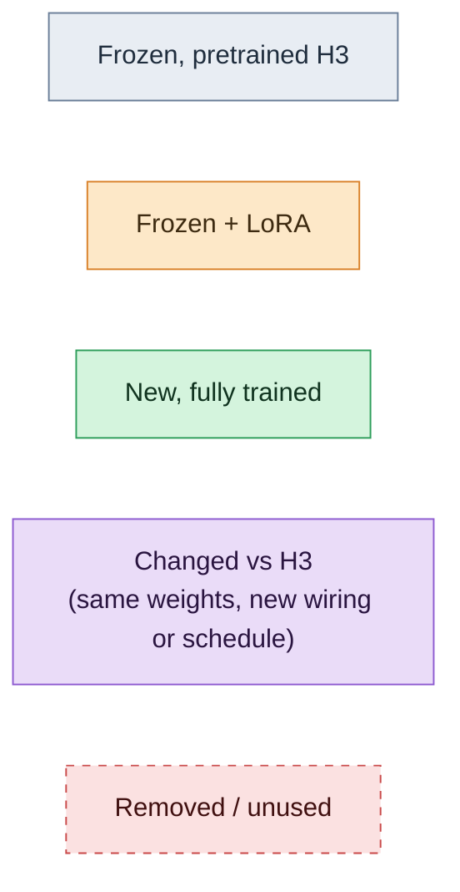
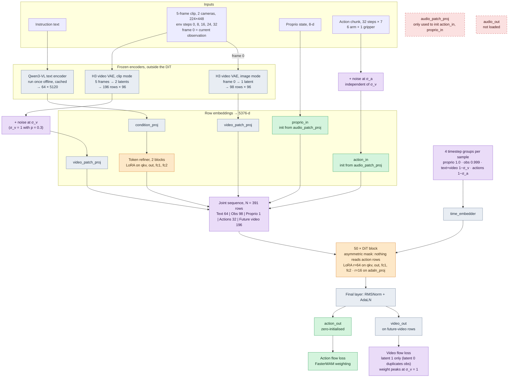
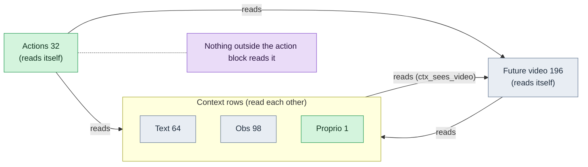
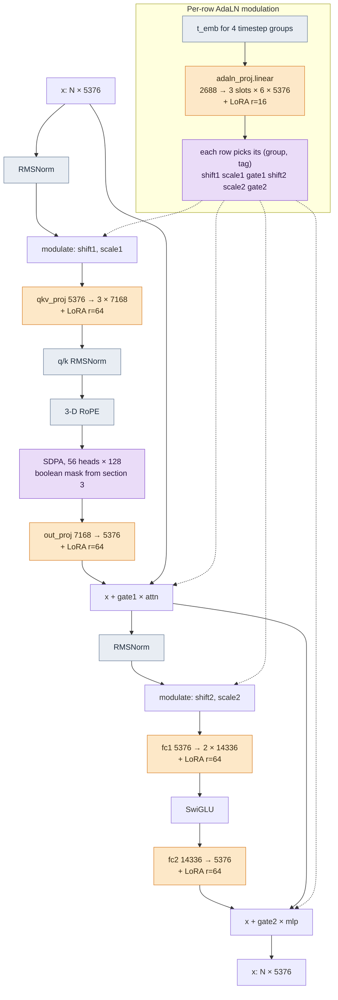
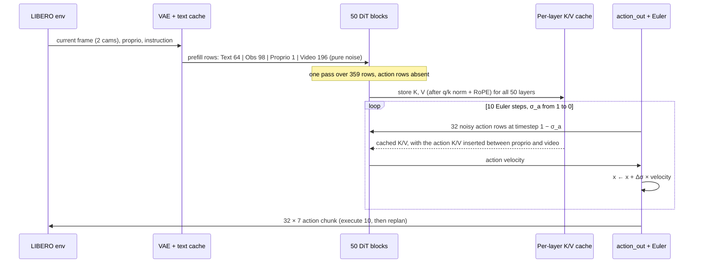

# WAM-H3 architecture

A record of the model being trained: a World Action Model built on the MiniMax-H3 33B DiT (reference: `tests/reference/minimax_h3_dit.py`, DiffSynth port of the FL2VA transformer). Code: `wam_h3/model/{dit,layers,layout,loss,lora,wam}.py`. Design rationale: `docs/superpowers/specs/2026-09-11-wam-h3-design.md`.

Numbers below are for LIBERO (`configs/data/libero_2cam.yaml`) and the single-GPU run `configs/task/libero_wamh3_1gpu.yaml` (LoRA rank 64, AdaLN rank 16). The dev run uses rank 16 everywhere; the 8-GPU full run uses rank 128.

**Legend** (used in every diagram)

## 1. Training forward pass

One LIBERO sample. Both cameras (agentview + wrist, 224×224 each) are concatenated side by side to 224×448. Frame 0 of the clip is the current observation.

Loss = video loss + action loss (λ = 1 each). Both are velocity targets `noise − x` (the DiT output is negated to match).

## 2. Sequence layout and per-row conditioning

Every row carries three pieces of conditioning: which AdaLN modality slot it uses (the "tag"), which of the 4 per-sample timesteps it gets, and a 3-D RoPE position. H3's `adaln_proj` produces 3 modality slots × 6 modulation chunks; each row picks its (timestep group, tag) pair, so the pretrained weight layout loads unchanged.

| Block | Rows | Content | AdaLN tag (H3 slot) | Timestep (1 = clean) | RoPE (t, h, w) |
|---|---|---|---|---|---|
| Text | 64 (right-aligned, padding masked) | refined Qwen3-VL embedding | 1 (text) | 1 − σ_v, like stock H3 | t = 0…63 |
| Obs | 98 (7 × 14 patches) | VAE latent of current frame | 0 (video) | 0.999 (H3 keyframe noise-aug) | t = 64, frame grid |
| Proprio | 1 | `proprio_in(state)` | **2 (audio)** | 1.0 | t = 64, h = 0, w = first column |
| Actions | 32 | `action_in(noisy action)` | **2 (audio)** | 1 − σ_a | t = 64 + (j/8)·5/3, h = 0, w = last column |
| Future video | 196 (2 latents × 98) | noisy VAE latents | 0 (video) | 1 − σ_v | t = 64 + H3 video time grid, frame grid |

Actions and video share the RoPE time axis, so action step *j* sits at the same time coordinate as the video frame it lines up with.

## 3. Who attends to what

One boolean N × N mask, shared by all 50 blocks (`wam_h3/model/layout.py`). Rows = queries, columns = keys.

| query ↓ reads key → | Text | Obs | Proprio | Actions | Future video |
|---|---|---|---|---|---|
| **Text** | ✓ | ✓ | ✓ | ✗ | ✓ ¹ |
| **Obs** | ✓ | ✓ | ✓ | ✗ | ✓ ¹ |
| **Proprio** | ✓ | ✓ | ✓ | ✗ | ✓ ¹ |
| **Actions** | ✓ | ✓ | ✓ | ✓ | ✓ |
| **Future video** | ✓ | ✓ | ✓ | ✗ | ✓ |

¹ `model.ctx_sees_video=true` (default, like H3 pretraining). Setting it to `false` gives FasterWAM's first-frame-causal variant, where text, obs and proprio read only each other.

Padded text keys are masked for every query. The token refiner has its own text-only attention over the 64 text rows.

**Why the asymmetry matters.** Because no context or video row depends on the actions, the context and video K/V at every layer are the same whatever the action values are. At inference they are computed once and reused across all action denoising steps (section 5). Stock H3 has no such restriction: text, video and audio all attend to each other bidirectionally within a sample.

## 4. Inside one DiT block (× 50)

`adaln_proj.linear` gets its own, lower rank (`model.lora_adaln_r`) because its only input is the timestep embedding. It holds 13B of the 33B base weights, so at a uniform rank it would take half of all LoRA parameters. The final layer's AdaLN stays frozen because it also modulates the frozen `video_out`.

## 5. Inference: one context pass, then 10 action-only steps

The future video is never denoised. It is fed as pure noise once, only so the context rows see the same input they saw during training at σ_v = 1.

Because of the mask in section 3, this reproduces a full forward pass exactly: each step runs the 50 blocks over just the 32 action rows.

## 6. What changed vs the reference H3

| | MiniMax-H3 (reference) | WAM-H3 |
|---|---|---|
| Task | text/image → joint video + audio generation | robot action prediction, with future-video prediction as an auxiliary loss |
| Modality slots | video, text, audio | video slot: obs + future video · text slot: instruction · **audio slot: proprio + actions** |
| Input projections | `video_patch_proj`, `condition_proj`, `audio_patch_proj` | first two frozen and reused · `audio_patch_proj` replaced by new `action_in` / `proprio_in` initialised from its weights |
| Output heads | `video_out`, `audio_out` | `video_out` frozen, used for the training loss only · `audio_out` dropped · new zero-initialised `action_out` |
| Attention | full bidirectional per sample, packed varlen (`cu_seqlens`) | batched `[B, N]` with one boolean mask; nothing reads action rows |
| Timesteps | per-row timesteps already supported (`unique_timesteps` + `inverse_indices`): keyframe rows at 0.999, text rows carry the video timestep | same mechanism, fixed to 4 groups per sample; the action rows get their own flow time, sampled independently of the video's (shift 5 for both) |
| Video loss weight | n/a (pretraining) | bump centred at σ_v = 1, with σ_v = 1 forced 30% of the time (FasterWAM centres at 0.5) |
| Inference | iterative denoising of video + audio | one prefill pass, K/V cache, 10 action-only Euler steps; video never denoised |
| Trained parameters | all | LoRA + 3 heads; everything else frozen |

**Parameter counts** (real H3 config, counted on the meta device):

| Config | Frozen base | Trainable | of which AdaLN LoRA | fp32 weights + grads + AdamW |
|---|---|---|---|---|
| Dev (r = 16) | 33.12B | 157M | 80M | 2.5 GB |
| **1-GPU run (r = 64, AdaLN r = 16)** | 33.12B | **390M** | 80M | 6.2 GB |
| Full run (r = 128) | 33.12B | 1,257M | 637M | 20.1 GB |

Trainable parameters of the 1-GPU run: about 298M block LoRA (attention + MLP), 80M AdaLN LoRA, 12M token-refiner LoRA and 0.1M in the three heads.
